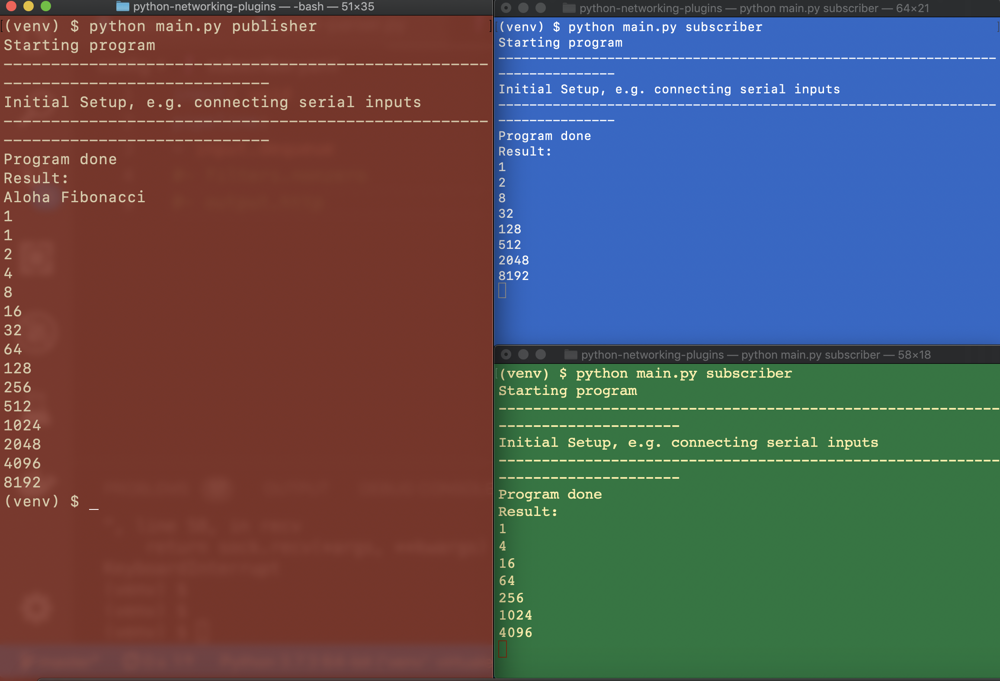

# What is this?

This project shows a Pythonic version of

- plugin architecture
- fast data crunching pipeline
- process communication using a message queue in Redis

# Roadmap

- define message format
- handle process orchestration with a tool like Dagster
- ✅ add aggregators, e.g. running mean, max_last_50
- add gearing, e.g. send packets of n messages to REST
- ✅ add flow/output timing other than incoming cadence
- lots of logging
- ✅ proper configuration formats
- serial emulator: https://stackoverflow.com/questions/2291772/virtual-serial-device-in-python
- check structure of yaml files


# Install

```
virtualenv --python=/usr/local/bin/python3.7 venv
source venv/bin/activate
pip install -r requirements.txt
docker-compose up -d
```

# Running

```
source venv/bin/activate
python main.py publisher

# in as many separate terminals as you want
source venv/bin/activate
python main.py subscriber
```



## Profiling


Start Redis and a random publisher:

```
docker-compose up -d
source venv/bin/activate
python main.py example.publisher.full_speed
```

And in a separate terminal a subscriber:

```
source venv/bin/activate
python main.py example.subscriber.speed_test
````

# Stuff to read

- https://medium.com/@johngrant/python-redis-pub-sub-6e26b483b3f7
- http://peter-hoffmann.com/2012/python-simple-queue-redis-queue.html